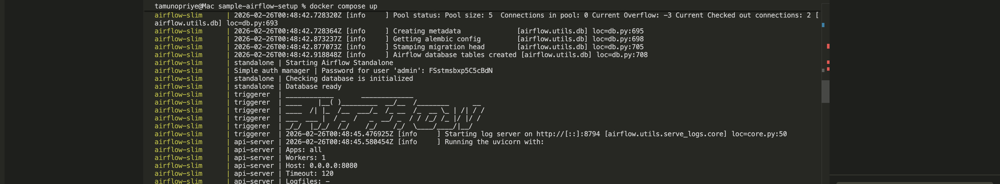
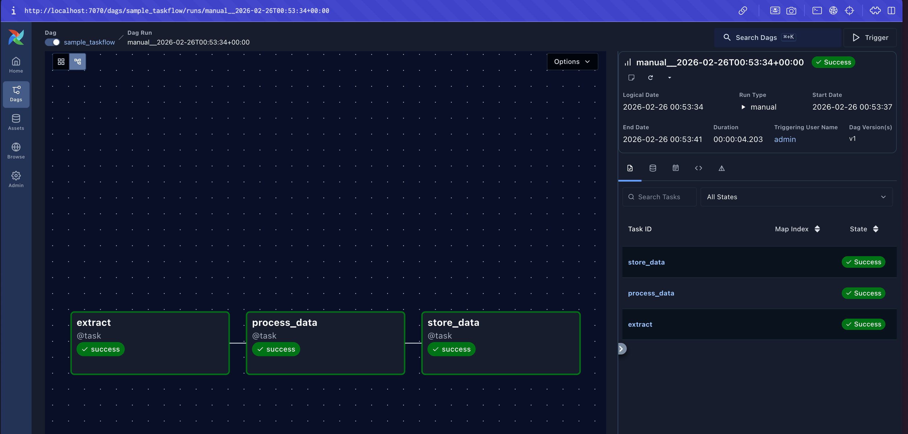

# Airflow Orchestrator Architecture

Lightweight, containerized Apache Airflow setup using slim images. Designed for EasyPoC, local experimentation, and rapid DAG iteration without heavy infrastructure.


## High-Level Overview

This setup runs Airflow in standalone mode and includes:

* Airflow and postgres Docker services
* Core Airflow service bundles:
  
  * Webserver
  * Scheduler
  * Triggerer

Optimized for:

* Local development
* DAG testing
* Workflow prototyping
* Architecture demonstrations

> Not intended for production workloads.

## Project Structure

```text
config/                 # Airflow configuration
dags/                   # DAG definitions
Dockerfile              # Custom slim Airflow image
docker-compose.yml      # Builds and runs services
```


## Getting Started

### Prerequisites

* Docker
* Docker Compose (v2 recommended)


### Clone the Repository

```bash
git clone <repo-url>
cd airflow
```


### Build and Start Infrastructure

```bash
docker compose build
docker compose up
```

This will:

* Build the Airflow slim image
* Initialize the metadata database
* Start Airflow services

Run in detached mode:

```bash
docker compose up
```

Stop services:

```bash
docker compose down
```

Clean reset (remove volumes):

```bash
docker compose down -v
```


## Access the Airflow UI

* URL: [http://localhost:8080](http://localhost:8080)
* Username: `admin`
* Password: Generated in terminal logs during first startup


## Trigger the Workflow

1. Open the Airflow UI
2. Enable the DAG
3. Click **Trigger DAG**


## Added DAGs

### Sample ETL DAG
Demonstrates a simple ETL workflow using the TaskFlow API.

Getting the password from terminal
 

sample DAG Run



**Extract**

* Fetches current Bitcoin price from an external API

**Transform**

* Converts API response into a pandas DataFrame:

  * `usd` – current Bitcoin price
  * `change` – 24-hour percentage change

**Load**

* Writes transformed output to `bitcoin_price.csv`


## Managing Environment Variables

### Option 1 — `.env` File (Recommended)

```bash
MY_KEY=my_value
```

### Option 2 — Airflow Variables (UI)

1. Navigate to **Admin → Variables**
2. Create:

   * Key: `my_key`
   * Value: `my_value`

Use inside DAG:

```python
from airflow.models import Variable
value = Variable.get("my_key")
```


## Installation Mode Used

Slim standalone Airflow deployment:

* Single container
* SQLite metadata database
* SequentialExecutor

Benefits:

* Fast startup
* Minimal resource usage
* No external dependencies
* Clean local developer experience


## Production Deployment

For production workloads requiring:

* External PostgreSQL
* Redis
* CeleryExecutor or KubernetesExecutor
* Horizontal scaling

Use the official Apache Airflow Docker Compose stack:

Docker Compose:
[https://airflow.apache.org/docs/apache-airflow/stable/docker-compose.yaml](https://airflow.apache.org/docs/apache-airflow/stable/docker-compose.yaml)

Documentation:
[https://airflow.apache.org/docs/apache-airflow/stable/howto/docker-compose/index.html](https://airflow.apache.org/docs/apache-airflow/stable/howto/docker-compose/index.html)


## Notes

* Logs are gitignored
* `.env` files are not committed
* Intended for local orchestration only
* Easily extendable to Postgres or Celery
